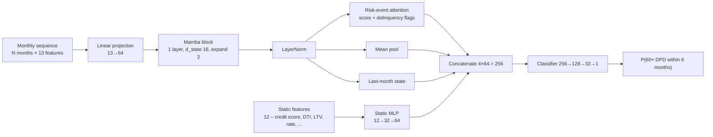
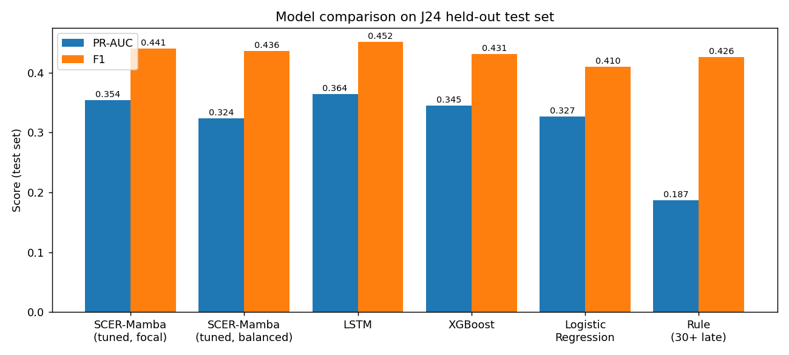
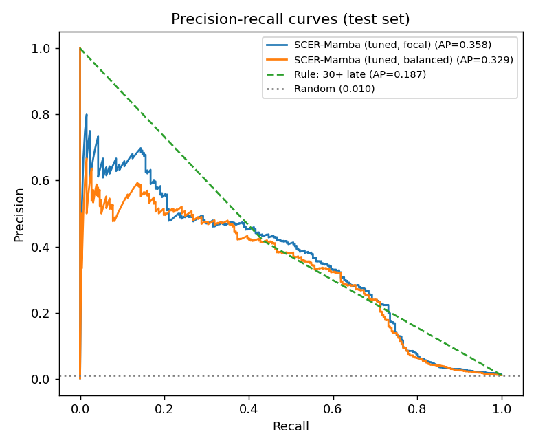
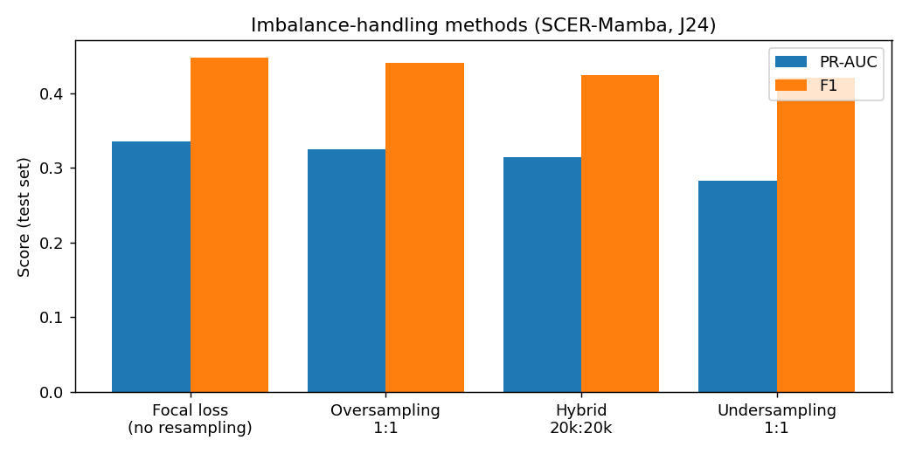
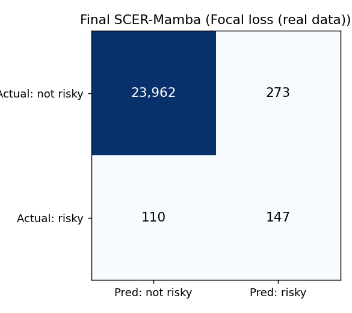
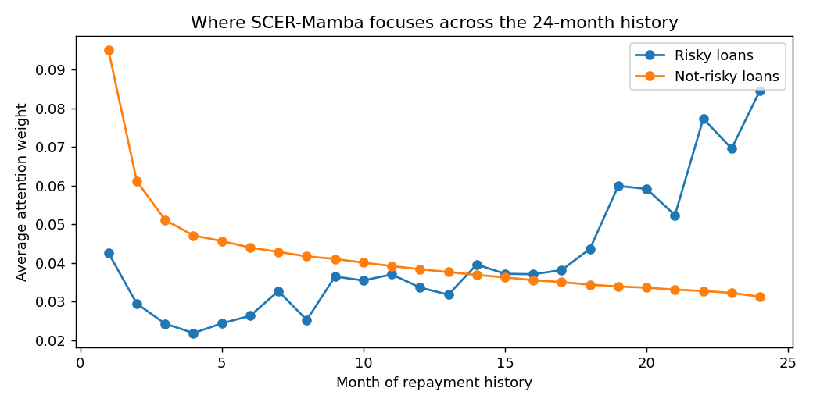
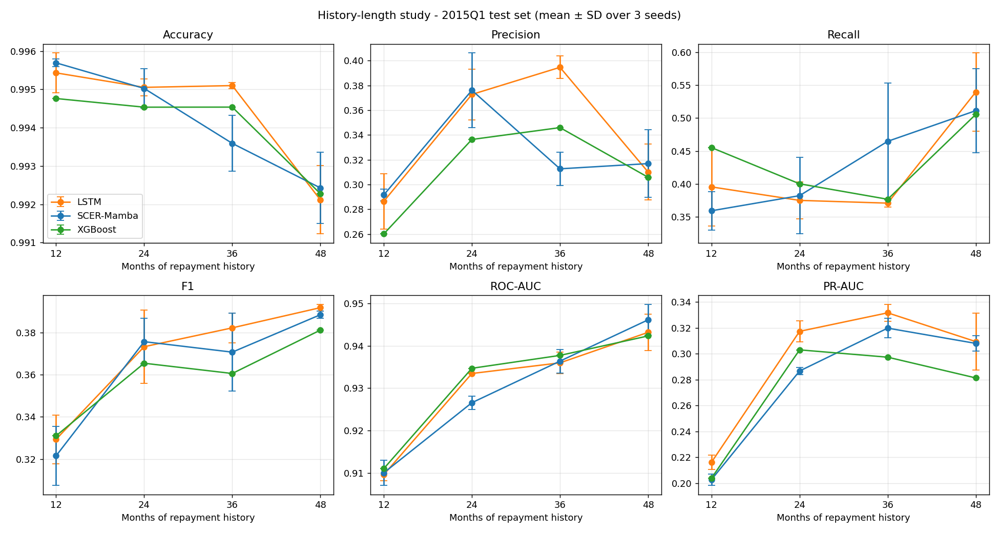
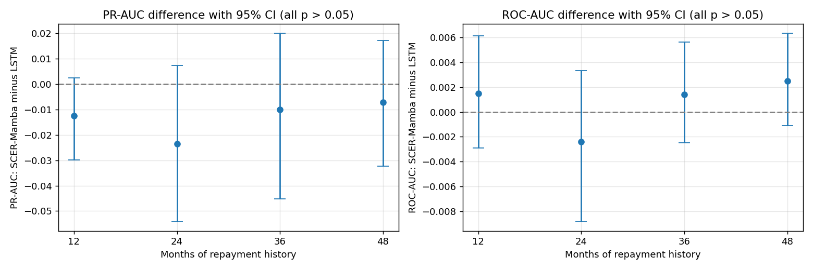
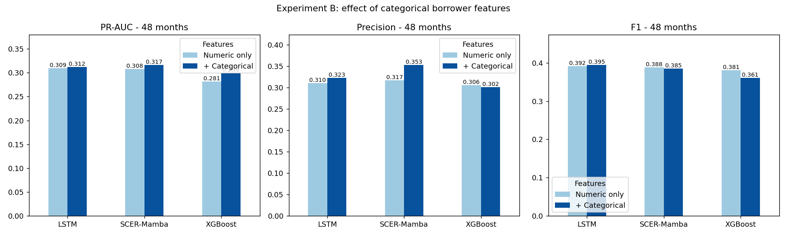

# SCER-Mamba: Predicting Mortgage Delinquency from Loan Repayment Histories

**SCER-Mamba** (Static-Conditioned, Event-aware, Risk-attentive Mamba) is a deep-learning model that reads a loan's monthly repayment history together with its origination details and predicts whether the loan will become **60+ days delinquent within the next 6 months**.

The project uses the public **Fannie Mae Single-Family Loan Performance** data (2023 Q1 and 2015 Q1 acquisitions). It compares SCER-Mamba against an LSTM, XGBoost, Logistic Regression and a simple rule, studies **class-imbalance handling** (risky loans are only about 1% of the data), and checks how much the length of the repayment history matters.

> **Status (October 2026):** research in progress. SCER-Mamba performs at the same level as an untuned LSTM: the differences are small and **not statistically significant**. Balancing the data with over/under-sampling did **not** improve results compared with focal loss. Open problems and the plan for the next round are in [docs/08_LIMITATIONS_AND_NEXT_STEPS.md](docs/08_LIMITATIONS_AND_NEXT_STEPS.md).

---

## 1. The problem in one paragraph

For each loan we look at its first *N* months of repayment (N = 12, 18, 24, 36 or 48). At the end of that window (the *observation month*) we ask: **will this loan reach 60+ days past due at any time in the next 6 months?** Loans already 60+ days late at the observation month are removed (we want *early* warning), and loans without 6 months of follow-up are removed (their label is unknown). Each loan appears once. Only about **1 in 100 loans** turns risky, so the data is highly imbalanced and plain accuracy is misleading (predicting "not risky" for everyone already gives ~99% accuracy). We therefore report **PR-AUC** as the main metric, plus F1, precision, recall and ROC-AUC.

## 2. Headline results

### 2.1 Main experiment – 2023 Q1, 24-month history (held-out test set: 257 risky / 24,235 not risky)

Mean ± SD over 3 random seeds (42, 123, 2026). Threshold chosen on validation, applied once to the test set.

| Model | Accuracy | Precision | Recall | F1 | ROC-AUC | **PR-AUC** |
|---|---|---|---|---|---|---|
| LSTM (baseline) | 0.987 | 0.405 ± 0.013 | 0.511 ± 0.020 | **0.452** ± 0.011 | **0.921** ± 0.001 | **0.364** ± 0.004 |
| **SCER-Mamba (final, focal loss)** | 0.986 | 0.382 ± 0.020 | **0.521** ± 0.010 | 0.441 ± 0.010 | 0.917 ± 0.002 | 0.354 ± 0.002 |
| SCER-Mamba + oversampling 1:1 | 0.986 | 0.388 ± 0.019 | 0.502 ± 0.047 | 0.436 ± 0.015 | 0.900 ± 0.005 | 0.324 ± 0.007 |
| XGBoost | – | 0.357 | 0.545 | 0.431 | 0.914 | 0.345 |
| Logistic Regression | – | 0.396 | 0.424 | 0.410 | 0.917 | 0.327 |
| Rule: "currently 30+ days late" | – | 0.416 | 0.436 | 0.426 | 0.715 | 0.187 |

PR-AUC of a random model here is ≈ 0.0105 (the risky rate), so all learned models are 30–35× better than random.

### 2.2 Class-balancing comparison (SCER-Mamba, 2023 Q1, 24 months, seed 42)

Balancing is applied to the **training set only**; validation and test keep the real ~1% ratio.

| Method | Train risky / not risky | F1 | **PR-AUC** |
|---|---|---|---|
| **Focal loss on real ratio (no resampling)** | 1,198 / 113,098 | **0.448** | **0.335** |
| Random oversampling (1:1) | 113,098 / 113,098 | 0.441 | 0.325 |
| Hybrid (20k / 20k) | 20,000 / 20,000 | 0.424 | 0.314 |
| Random undersampling (1:1) | 1,198 / 1,198 | 0.421 | 0.283 |

### 2.3 History-length study – 2015 Q1 (pre-COVID), mean of 3 seeds, test PR-AUC

| History | Loans | Risky | SCER-Mamba | LSTM | XGBoost | SCER vs LSTM p-value |
|---|---|---|---|---|---|---|
| 12 months | 365,200 | 1,041 | 0.203 | **0.216** | 0.204 | 0.12 |
| 24 months | 313,494 | 1,232 | 0.287 | **0.317** | 0.303 | 0.14 |
| 36 months | 276,990 | 1,130 | 0.320 | **0.332** | 0.297 | 0.46 |
| 48 months | 249,424 | 1,172 | 0.308 | **0.309** | 0.281 | 0.53 |
| 48 m + categorical features (Exp. B) | 249,424 | 1,172 | **0.317** | 0.312 | 0.299 | 0.76 |

p-values: paired bootstrap (2,000 resamples) on 3-seed ensembles. **None** of the SCER-Mamba vs LSTM differences is significant at 0.05. Longer history helps every model up to 36 months.

### 2.4 What SCER-Mamba adds even when it ties

* **Interpretability:** its risk-event attention puts **3.7×** (2023 Q1) and **3.8×** (2015 Q1, 48 m) more weight on months where the borrower was 30+ days late, so each prediction can be explained by pointing at the months that drove it.
* **Stability:** lowest seed-to-seed variance of the deep models (PR-AUC SD 0.002 vs 0.004 for LSTM).
* **Beats XGBoost on long histories** (36 and 48 months).

Full tables: [docs/07_RESULTS.md](docs/07_RESULTS.md).

## 3. Model architecture (final version, "S3")



Training: focal loss (γ = 2), AdamW (lr 3e-4, wd 1e-4), batch 256, gradient clipping 1.0, early stopping on validation PR-AUC (patience 4, max 20 epochs), decision threshold that maximises F1 on validation. Details: [docs/04_METHODOLOGY.md](docs/04_METHODOLOGY.md).

## 4. Figures

| | |
|---|---|
|  Model comparison, 2023 Q1 |  Precision–recall curves |
|  Balancing methods |  Confusion matrix |
|  Attention on late vs on-time months |  History-length study |
|  Significance test |  Experiment B (+ categorical) |

All figures with captions: [docs/07_RESULTS.md](docs/07_RESULTS.md#figures).

## 5. Repository layout

```
SCER-Mamba-Loan-Delinquency/
├── README.md                      ← you are here
├── requirements.txt
├── docs/                          ← full documentation (read in order 01 → 09)
│   ├── 01_PROJECT_OVERVIEW.md
│   ├── 02_DATA.md
│   ├── 03_PREPROCESSING.md
│   ├── 04_METHODOLOGY.md          (architecture, losses, balancing, evaluation)
│   ├── 05_EXPERIMENT_LOG.md       (every experiment in the order it was run)
│   ├── 06_HOW_TO_RUN.md
│   ├── 07_RESULTS.md              (all tables + figure captions)
│   ├── 08_LIMITATIONS_AND_NEXT_STEPS.md
│   ├── 09_FILE_GUIDE.md           (what every script does)
│   ├── SCER-Mamba_Results_Summary_with_Figures.docx
│   └── SCER_Mamba_project_summary.xlsx
├── preprocessing/
│   ├── 2023Q1/                    ← local (VS Code) pipeline: cleaning → targets → sequences
│   └── 2015Q1/                    ← raw split + 12/24/36/48-month cohorts
├── src/
│   ├── early_experiments/         ← first models, ablations, LSTM, SCER v1/v2 (local)
│   ├── J24_final/                 ← 2023 Q1 24-month experiments (Colab)
│   └── 2015Q1_study/              ← history length, significance, Exp. B, Exp. C (Colab)
├── notebooks/RadarSeq_colab.ipynb ← original Colab notebook (114 cells)
├── results/                       ← CSV / TXT outputs of every experiment
├── figures/                       ← main, EDA and early-stage figures
└── models/                        ← final SCER-Mamba S3 weights (3 seeds, ~300 KB each)
```

## 6. Quick start

```bash
git clone <this-repo>
cd SCER-Mamba-Loan-Delinquency
pip install -r requirements.txt
```

1. Download the Fannie Mae Single-Family Loan Performance files (2023Q1 and/or 2015Q1) from <https://capitalmarkets.fanniemae.com/credit-risk-transfer/single-family-credit-risk-transfer/fannie-mae-single-family-loan-performance-data> (free registration). **The data is not included in this repository** (licence and size).
2. Run the preprocessing scripts in order (see [docs/06_HOW_TO_RUN.md](docs/06_HOW_TO_RUN.md)).
3. Run the experiment scripts in Google Colab with a GPU (T4 is enough).

## 7. Honest summary

* The pipeline (labels, splits, leakage checks, threshold selection, multiple seeds, significance testing) is sound and reproducible.
* SCER-Mamba is **competitive with, but not better than**, an LSTM on this task. With ~1,000 risky loans per cohort the test sets contain only ~170–260 positives, so differences of ±0.01–0.03 PR-AUC are within noise.
* Resampling (over/under/hybrid) does not beat focal loss; this is a common finding for highly imbalanced, probability-ranking tasks because resampling distorts calibration and adds duplicated or discarded information.
* Next steps to improve both the balancing and the model are listed in [docs/08_LIMITATIONS_AND_NEXT_STEPS.md](docs/08_LIMITATIONS_AND_NEXT_STEPS.md).

## 8. Author

Shirisha – MSc Computer Science, University of East London.
Data: © Fannie Mae, used under its public data terms. This repository contains code and derived results only.
